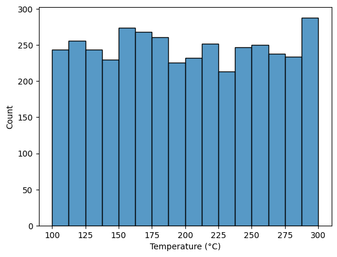
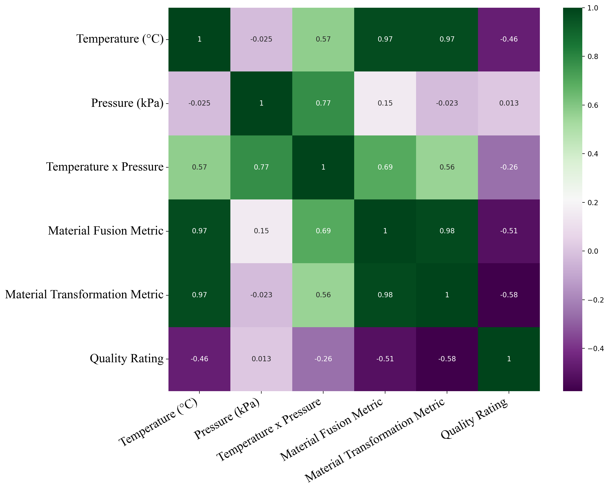
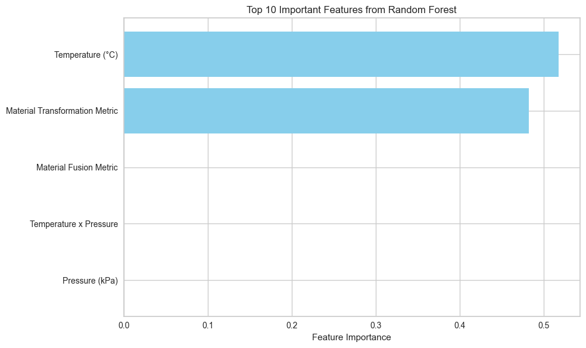
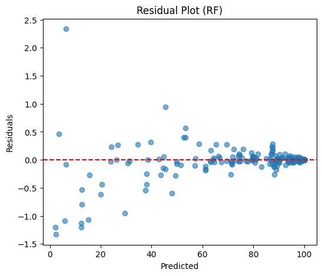
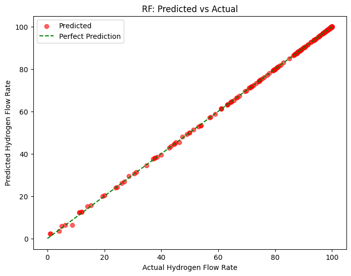
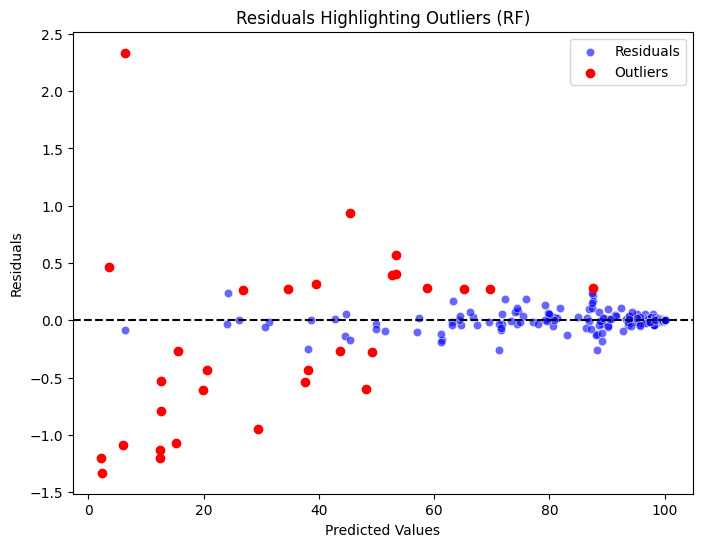

<!DOCTYPE html>
<html lang="en">

<head>
<meta charset="UTF-8">
<meta name="viewport" content="width=device-width, initial-scale=1.0">
<title>Manufacturing Product Quality Rating Prediction - README</title>
</head>
<body>

<h1>Manufacturing Product Quality Rating Prediction Using Machine Learning</h1>

Machine learning project for predicting manufacturing product quality ratings using
process parameters and engineered features. The project includes EDA, preprocessing,
feature engineering, regression modeling, evaluation, and industrial insights.

<h2>Engineering Problem</h2>

Manufacturing industries require accurate quality monitoring to reduce defects,
improve production efficiency, and optimize operating conditions.
This project develops predictive models to estimate product quality based on
manufacturing parameters such as temperature, pressure, and material behavior metrics.

<h2>Objectives</h2>
<ul>
<li>Build regression models for product quality prediction.</li>
<li>Analyze relationships between manufacturing parameters and quality.</li>
<li>Create engineering features for non-linear process behavior.</li>
<li>Compare SVR, Decision Tree, and Random Forest models.</li>
<li>Evaluate models using RMSE, MAE, MSE, and R² score.</li>
<li>Identify important quality-driving features.</li>

</ul>

<h2>Dataset Description</h2>

<table border="1">
<tr>
<th>Property</th>
<th>Description</th>
</tr>

<tr>
<td>Industry</td>
<td>Manufacturing Process Optimization</td>
</tr>

<tr>
<td>Problem Type</td>
<td>Regression</td>
</tr>

<tr>
<td>Target</td>
<td>Quality Rating</td>
</tr>

<tr>
<td>Features</td>
<td>Process variables + engineered features</td>
</tr>

<tr>
<td>Missing Values</td>
<td>None</td>
</tr>

</table>

<h3>Features</h3>

<ul>

<li><b>Tempereture (°C):</b> Manufacturing operating temperature.</li>
<li><b>Pressure (kPa):</b> Applied manufacturing pressure.</li>
<li><b>Temperature × Pressure:</b> Interaction effect between process variables.</li>
<li><b>Material Fusion Metric:</b> Feature representing fusion behavior.</li>
<li><b>Material Transformation Metric:</b> Feature representing transformation dynamics.</li>
<li><b>Quality Rating:</b> Target variable.</li>

</ul>

<h2>Exploratory Data Analysis</h2>

<ul>

<li>Temperature and pressure show stable distributions with low skewness.</li>
<li>Engineered features capture additional process complexity.</li>

<li>
Quality Rating shows strong negative skewness (-4.48) and high kurtosis (21.61),
indicating most products achieve high quality with rare failures.
</li>

<li>
Dataset contains no missing values and provides sufficient variation for modeling.
</li>

</ul>

<h3>Correlation Analysis</h3>
<pre>

def corr_heat(dataset):
    plt.figure(figsize=(12,10),dpi=200)
    sns.heatmap(
        dataset.corr(),
        cmap='PRGn',
        annot=True)
    plt.show()

</pre>

<h2>Machine Learning Pipeline</h2>

<pre>

Raw Data

 ↓

Data Cleaning

 ↓

Missing Value Check

 ↓

Feature Engineering

 ↓

Encoding

 ↓

Scaling

 ↓

Train/Test Split (80/20)

 ↓

Model Training

 ↓

Evaluation

</pre>

<h2>Feature Engineering</h2>

<pre>
# Temperature and Pressure interaction
dataset["Temperature_Pressure"] = (
    dataset["Temperature"] *
    dataset["Pressure"])

# Material Fusion
dataset["Material_Fusion"] = (
    dataset["Temperature"]**2 +
    dataset["Pressure"]**3)

# Material Transformation
dataset["Material_Transformation"] = (
    dataset["Temperature"]**3 -
    dataset["Pressure"]**2)
</pre>

<h2>Preprocessing</h2>

<h3>Scaling</h3>

<pre>
scaler = StandardScaler()
X_scaled = scaler.fit_transform(X)

</pre>

<h3>Train/Test Split</h3>

<pre>
X_train, X_test, y_train, y_test = train_test_split(X,y,test_size=0.20,random_state=42)
</pre>

<h2>Machine Learning Models</h2>

<table border="1">

<tr>
<th>Model</th>
<th>Description</th>
</tr>

<tr>
<td>SVR</td>
<td>Kernel-based regression model for non-linear relationships.</td>
</tr>

<tr>
<td>Decision Tree</td>
<td>Tree model capturing process decision patterns.</td>
</tr>

<tr>
<td>Random Forest</td>
<td>Ensemble model combining multiple trees for improved accuracy.</td>
</tr>

</table>

<h2>Random Forest Model</h2>

<pre>

def ZF_RF_Regression(X_train, X_test, y_train, y_test, n_estimators=200, max_depth=None, random_state=42):
    """
    Random Forest Regression Model
    Includes full evaluation and visualization similar to ANN function.
    """

    # ----------------------------
    # 1️⃣ Build and train Random Forest model
    model_rf = RandomForestRegressor(
        n_estimators=n_estimators,
        max_depth=max_depth,
        random_state=random_state,
        n_jobs=-1
    )
    model_rf.fit(X_train, y_train)

    # ----------------------------
    # 2️⃣ Predictions
    y_train_pred = model_rf.predict(X_train)
    y_test_pred = model_rf.predict(X_test)

    # ----------------------------
    # 3️⃣ Metrics
    metrics_train = {"RMSE": np.sqrt(mean_squared_error(y_train, y_train_pred)),
                     "MAE": mean_absolute_error(y_train, y_train_pred),
                     "R2": r2_score(y_train, y_train_pred)}
    metrics_test = {"RMSE": np.sqrt(mean_squared_error(y_test, y_test_pred)),
                    "MAE": mean_absolute_error(y_test, y_test_pred),
                    "R2": r2_score(y_test, y_test_pred)}

    print("=== RF Train Metrics ===", metrics_train)
    print("=== RF Test Metrics ===", metrics_test)

    sq_diff = np.mean((y_train_pred.mean() - y_test_pred.mean())**2)
    print(f"Train/Test Mean Squared Difference: {sq_diff:.4f}")

    # ----------------------------
    # Residuals
    residuals = y_test - y_test_pred
    standardized_residuals = residuals / np.std(residuals)

    # Residual plot
    plt.figure(figsize=(6, 5))
    plt.scatter(y_test_pred, residuals, alpha=0.6)
    plt.axhline(0, color="red", linestyle="--")
    plt.xlabel("Predicted")
    plt.ylabel("Residuals")
    plt.title("Residual Plot (RF)")
    plt.show()

    # Standardized Residuals
    plt.figure(figsize=(8, 6))
    sns.scatterplot(x=y_test_pred, y=standardized_residuals, color='purple', alpha=0.6)
    plt.axhline(0, color='black', linestyle='--')
    plt.axhline(2, color='red', linestyle='--')
    plt.axhline(-2, color='red', linestyle='--')
    plt.title("Standardized Residuals (RF)")
    plt.show()

    # ----------------------------
    # Predicted vs Actual (linear)
    plt.figure(figsize=(8, 6))
    max_val = max(y_test.max(), y_test_pred.max())
    plt.scatter(y_test, y_test_pred, color='red', alpha=0.6, label='Predicted')
    plt.plot([0, max_val], [0, max_val], color='green', linestyle='--', label='Perfect Prediction')
    plt.xlabel("Actual Hydrogen Flow Rate")
    plt.ylabel("Predicted Hydrogen Flow Rate")
    plt.title("RF: Predicted vs Actual")
    plt.legend()
    plt.show()

    # ----------------------------
    # Q-Q plot
    plt.figure(figsize=(8, 6))
    stats.probplot(residuals, dist="norm", plot=plt)
    plt.title('Q-Q Plot of Residuals (RF)')
    plt.show()

    # ----------------------------
    # Residual outliers
    threshold = 2 * np.std(residuals)
    outliers = residuals[np.abs(residuals) > threshold]
    plt.figure(figsize=(8, 6))
    sns.scatterplot(x=y_test_pred, y=residuals, color='blue', alpha=0.6, label='Residuals')
    plt.scatter(y_test_pred[np.abs(residuals) > threshold], outliers, color='red', label='Outliers')
    plt.axhline(0, color='black', linestyle='--')
    plt.title("Residuals Highlighting Outliers (RF)")
    plt.xlabel("Predicted Values")
    plt.ylabel("Residuals")
    plt.legend()
    plt.show()

    return model_rf, metrics_train, metrics_test, sq_diff

</pre>

<h3>Feature Importance</h3>

<pre>

importance = pd.DataFrame({"Feature": X.columns,"Importance":model_rf.feature_importances_})
importance.sort_values(by="Importance",ascending=False)
</pre>

<h2>Model Results</h2>

<table border="1">
<tr>
<th>Model</th>
<th>R² Score</th>
<th>RMSE</th>
</tr>

<tr>
<td>SVR</td>
<td>0.687886</td>
<td>7.907324</td>
</tr>

<tr>
<td>Decision Tree</td>
<td>0.999885</td>
<td>0.151530</td>
</tr>

<tr>
<td><b>Random Forest</b></td>
<td><b>0.999912</b></td>
<td><b>0.132937</b></td>
</tr>

</table>

<h2>Random Forest Performance</h2>

<ul>

<li>MSE: 0.1180</li>

<li>RMSE: 0.3436</li>

<li>MAE: 0.0622</li>

<li>R² Score: 99.94%</li>

</ul>

<h2>Key Insights</h2>

<ul>

<li>
Random Forest achieved the highest accuracy because it captures complex
non-linear manufacturing relationships.
</li>

<li>
Temperature, pressure, and engineered interaction features strongly influence
quality prediction.
</li>

<li>
The model can support predictive quality control and early defect detection.
</li>

</ul>

<h2>Technologies Used</h2>

<ul>

<li>Python</li>

<li>Pandas / NumPy</li>

<li>Scikit-learn</li>

<li>Random Forest</li>

<li>Decision Tree</li>

<li>SVR</li>

<li>Matplotlib</li>

<li>Seaborn</li>

<li>Jupyter Notebook</li>

</ul>

<h2>Future Improvements</h2>

<ul>

<li>XGBoost, LightGBM, and CatBoost optimization.</li>

<li>Bayesian hyperparameter optimization.</li>

<li>SHAP explainability analysis.</li>

<li>Streamlit real-time quality monitoring dashboard.</li>

<li>Industrial IoT sensor integration.</li>

</ul>

<h2>Conclusion</h2>

This project demonstrates an end-to-end machine learning approach for smart
manufacturing quality prediction. Random Forest achieved the best performance
with <b>R² = 0.999912</b> and <b>RMSE = 0.132937</b>, showing strong capability
for predictive quality monitoring.

</body>

</html>
