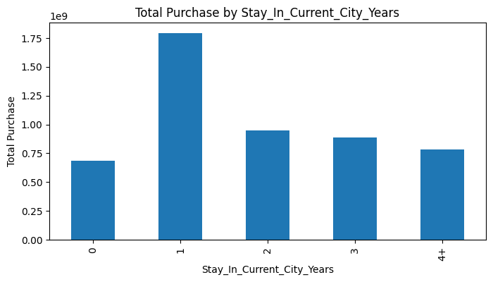
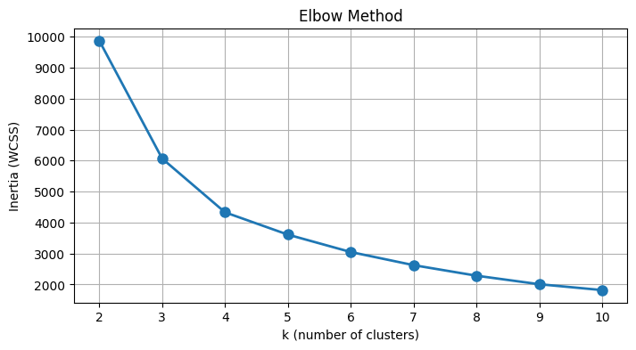
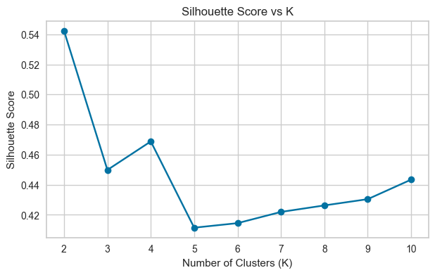
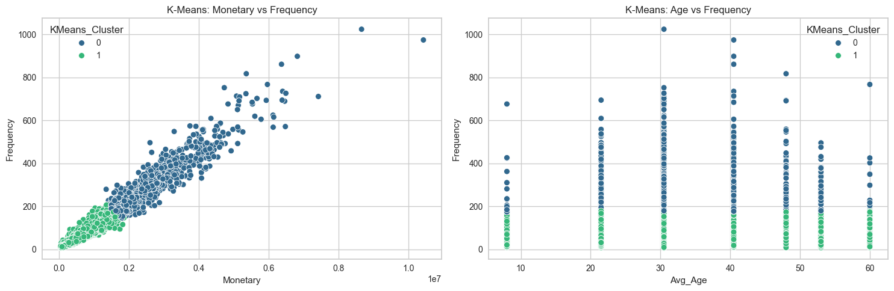
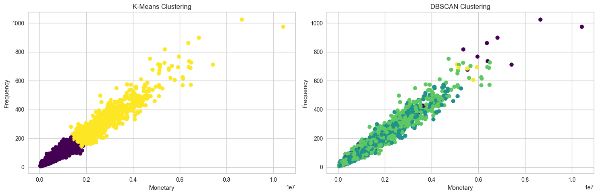
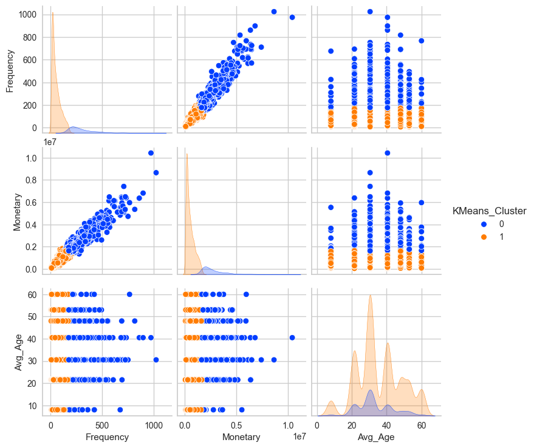

<h1 align="center">
Customer Segmentation on Walmart Sales Data
</h1>

Unsupervised Machine Learning Approach using PCA, K-Means and DBSCAN

<h2 style="color:#008000;"> Project Overview</h2>

In the modern retail industry, understanding customer purchasing behavior is essential
for improving customer experience, increasing revenue, and developing personalized marketing strategies.

This project applies <b>unsupervised machine learning techniques</b> to Walmart transactional data
to identify meaningful customer segments based on:

<ul>
<li>Purchase frequency</li>
<li>Total spending behavior</li>
<li>Customer demographics</li>
<li>Age characteristics</li>
</ul>

The objective is to transform raw transaction data into actionable customer intelligence
that can support marketing decisions, customer loyalty programs, and business growth.

<h2> Project Aim</h2>

The main goal of this project is to create customer segments that represent different
shopping behaviors using clustering algorithms.

<ul>

<li>
Identify high-value customers contributing the most revenue
</li>

<li>
Discover customer groups with similar purchasing patterns
</li>

<li>
Support personalized marketing campaigns
</li>

<li>
Improve customer retention and lifetime value
</li>

<li>
Optimize inventory and promotional strategies
</li>

</ul>

<h2> Dataset Description</h2>

The Walmart dataset contains transactional information from 
<b>550,068 purchase records</b>.

<table>

<tr>
<th>Feature</th>
<th>Description</th>
</tr>

<tr>
<td>User_ID</td>
<td>Unique customer identifier</td>
</tr>

<tr>
<td>Product_ID</td>
<td>Purchased product identifier</td>
</tr>

<tr>
<td>Gender</td>
<td>Customer gender</td>
</tr>

<tr>
<td>Age</td>
<td>Customer age group</td>
</tr>

<tr>
<td>Occupation</td>
<td>Customer occupation category</td>
</tr>

<tr>
<td>City_Category</td>
<td>Customer city category</td>
</tr>

<tr>
<td>Marital_Status</td>
<td>Marriage status indicator</td>
</tr>

<tr>
<td>Product_Category</td>
<td>Product category information</td>
</tr>

<tr>
<td>Purchase</td>
<td>Transaction amount</td>
</tr>

</table>

<h2> Data Cleaning & Preprocessing</h2>

<h3>Data Quality Issues</h3>

<table>

<tr>
<th>Issue</th>
<th>Impact</th>
<th>Solution</th>
</tr>

<tr>

<td>
Missing Values
</td>

<td>
Missing customer information can reduce clustering quality.
</td>

<td>
Analyzed missing patterns and applied appropriate handling strategies.
</td>

</tr>

<tr>

<td>
Duplicate Records
</td>

<td>
Duplicates can artificially increase customer activity.
</td>

<td>
Removed duplicate transaction records.
</td>

</tr>

<tr>

<td>
Categorical Variables
</td>

<td>
Machine learning algorithms require numerical input.
</td>

<td>
Encoded categorical variables where required.
</td>

</tr>

<tr>

<td>
Different Feature Scales
</td>

<td>
Large-value features dominate distance calculations.
</td>

<td>
Applied StandardScaler before clustering.
</td>

</tr>

</table>

<h2> Feature Engineering</h2>

<h3>Customer-Level Aggregation</h3>

Instead of analyzing individual transactions, customer behavior was aggregated
into customer-level features.

<h3>RFM + Age Framework</h3>

<table>

<tr>
<th>Feature</th>
<th>Description</th>
</tr>

<tr>

<td>
Frequency
</td>

<td>
Number of purchases made by each customer.
</td>

</tr>

<tr>

<td>
Monetary
</td>

<td>
Total spending amount of each customer.
</td>

</tr>

<tr>

<td>
Avg_Age
</td>

<td>
Average customer age converted into numerical values.
</td>

</tr>

</table>

<h3>Age Transformation</h3>

<pre>

age_map = {

"0-17":8,
"18-25":21.5,
"26-35":30.5,
"36-45":40.5,
"46-50":48,
"51-55":53,
"55+":60}

df["Age_num"] = df["Age"].map(age_map)

</pre>

<h3>Customer Aggregation Code</h3>

<pre>

rfm_age = df.groupby("User_ID").agg(

Frequency=("Product_ID","count"),

Monetary=("Purchase","sum"),

Avg_Age=("Age_num","mean")

).reset_index()

</pre>

<h3>Generated Dataset</h3>

<ul>

<li>
Customer-level records: 5,891 customers
</li>

<li>
Features used:
<ul>
<li>Frequency</li>
<li>Monetary</li>
<li>Avg_Age</li>
</ul>
</li>

</ul>

<h2> Modeling Challenges & Solutions</h2>

<table>

<tr>
<th>Challenge</th>
<th>Solution</th>
</tr>

<tr>

<td>
Outliers in spending behavior
</td>

<td>
Applied scaling and clustering methods less sensitive to extreme values.
</td>

</tr>

<tr>

<td>
Choosing optimal number of clusters
</td>

<td>
Used Elbow Method and Silhouette Score evaluation.
</td>

</tr>

<tr>

<td>
High dimensional customer behavior
</td>

<td>
Applied PCA for dimensionality reduction and visualization.
</td>

</tr>

<tr>

<td>
Different cluster shapes
</td>

<td>
Compared K-Means and DBSCAN clustering algorithms.
</td>

</tr>

</table>

<h2> Dimensionality Reduction using PCA</h2>

Customer behavior features were reduced using 
<b>Principal Component Analysis (PCA)</b> to visualize customer groups in two-dimensional space.

<h3>PCA Implementation</h3>

<pre>

from sklearn.decomposition import PCA

pca = PCA(n_components=2)

X_pca = pca.fit_transform(X_scaled)

pca_df = pd.DataFrame(
    X_pca,
    columns=["PCA1","PCA2"])

</pre>

<h3>PCA Visualization</h3>

PCA helps visualize customer similarities and differences after transforming
multiple customer behavior features into two principal components.

<h2> Customer Segmentation Modeling</h2>

<h3>1. K-Means Clustering</h3>

K-Means was selected as the primary segmentation algorithm because customer purchasing
behavior generally forms structured groups based on spending and frequency.

<h3>K-Means Algorithm</h3>

<pre>

from sklearn.cluster import KMeans

kmeans = KMeans(

    n_clusters=3,

    random_state=42,

    n_init=10)

rfm_age["KMeans_Cluster"] = kmeans.fit_predict(X_scaled)

</pre>

<h2> Selecting Optimal Number of Clusters</h2>

<h3>Elbow Method</h3>

The Elbow Method evaluates cluster compactness using Within Cluster Sum of Squares (WCSS).
The optimal cluster number is selected where additional clusters provide limited improvement.

<pre>

wcss=[]

for k in range(2,10):

    km = KMeans(

        n_clusters=k,

        random_state=42,

        n_init=10)

    km.fit(X_scaled)

    wcss.append(km.inertia_)

</pre>

The elbow curve shows an inflection point around several cluster values.
Considering model simplicity and business interpretation, 
<b>3 clusters were selected.</b>

<h2> Silhouette Score Analysis</h2>

Silhouette Score measures how well customers are separated between clusters.
Higher values indicate better-defined segments.

<pre>

from sklearn.metrics import silhouette_score

sil_scores=[]

for k in range(2,10):

    km=KMeans(

        n_clusters=k,

        random_state=42)

    labels=km.fit_predict(X_scaled)

    score=silhouette_score(
        X_scaled,
        labels )

    sil_scores.append(score)
</pre>

<h3>Cluster Selection Strategy</h3>

<ul>

<li>
Elbow Method → identifies optimal complexity
</li>

<li>
Silhouette Score → validates cluster separation
</li>

<li>
Business interpretation → ensures actionable segments
</li>

</ul>

<h2> DBSCAN Comparison</h2>

DBSCAN was evaluated as an alternative clustering approach because it can detect:

<ul>

<li>Non-spherical clusters</li>

<li>Noise points</li>

<li>Rare customer behaviors</li>

</ul>

<h3>K-Means vs DBSCAN</h3>

<table>

<tr>

<th>
Algorithm
</th>

<th>
Strength
</th>

<th>
Limitation
</th>

</tr>

<tr>

<td>
K-Means
</td>

<td>
Creates clear customer groups and assigns every customer.
</td>

<td>
Requires predefined cluster number and sensitive to outliers.
</td>

</tr>

<tr>

<td>
DBSCAN
</td>

<td>
Detects dense customer groups and identifies unusual behavior.
</td>

<td>
Sensitive to parameter selection.
</td>

</tr>

</table>

<h3>Final Algorithm Selection</h3>

K-Means was selected as the final segmentation model because:

<ul>

<li>
Customer groups were relatively structured.
</li>

<li>
All customers could be assigned to a segment.
</li>

<li>
Results were easier to interpret for marketing decisions.
</li>

</ul>

<h2> Cluster Profiling Results</h2>

<h3>Customer Segment Analysis</h3>

<table>

<tr>

<th>
Cluster
</th>

<th>
Customer Profile
</th>

<th>
Business Meaning
</th>

</tr>

<tr>

<td>
Cluster 0
</td>

<td>

High Frequency 
High Monetary Value

</td>

<td>

High-value customers

</td>

</tr>

<tr>

<td>
Cluster 1
</td>

<td>

Low Frequency 
Lower Spending

</td>

<td>

Growth opportunity customers

</td>

</tr>

</table>

<h3>Cluster Statistics</h3>

<table>

<tr>

<th>
Cluster
</th>

<th>
Frequency
</th>

<th>
Monetary
</th>

<th>
Average Age
</th>

</tr>

<tr>

<td>
Cluster 0
</td>

<td>
≈300
</td>

<td>
≈2.66M
</td>

<td>
33.3
</td>

</tr>

<tr>

<td>
Cluster 1
</td>

<td>
≈56
</td>

<td>
≈0.54M
</td>

<td>
35.6
</td>

</tr>

</table>

<h3>Cluster Visualization</h3>

<h2> Business Insights</h2>

<ul>

<li>

<b>High-Value Customers:</b>

Cluster 0 customers generate significantly higher revenue and purchase more frequently.

 

<b>Recommendation:</b>
Create VIP loyalty programs, exclusive promotions, and personalized offers.

</li>

 

<li>

<b>Low Engagement Customers:</b>

Cluster 1 customers have lower purchase frequency and spending.

 

<b>Recommendation:</b>
Use discount campaigns, product recommendations, and customer engagement strategies.

</li>

 

<li>

<b>Age Impact:</b>

Average age differences between clusters are small.

 

<b>Insight:</b>
Purchase behavior is mainly driven by Frequency and Monetary value rather than age.

</li>

 

<li>

<b>Product Strategy:</b>

High-performing product categories should receive priority in inventory planning.

</li>

</ul>

<h2> Business Recommendations</h2>

<ul>

<li>

Develop customer-specific marketing campaigns.

</li>

<li>

Reward high-value customers through loyalty programs.

</li>

<li>

Increase spending from low-value customers using personalized recommendations.

</li>

<li>

Optimize inventory based on purchasing patterns.

</li>

<li>

Use segmentation results for targeted advertising.

</li>

</ul>

<h2> Final Conclusion</h2>

This project successfully applied unsupervised machine learning techniques to transform
Walmart transactional data into meaningful customer segments.

The combination of:

<ul>

<li>
RFM Customer Analysis
</li>

<li>
Feature Engineering
</li>

<li>
PCA Dimensionality Reduction
</li>

<li>
K-Means Clustering
</li>

<li>
DBSCAN Comparison
</li>

<li>
Cluster Profiling
</li>

</ul>

enabled the identification of different customer behaviors and generated actionable
business recommendations.

The final K-Means segmentation provides Walmart with a data-driven framework to improve
customer targeting, increase retention, and maximize customer lifetime value.

<h2>Technologies Used</h2>

<ul>

<li>Python</li>
<li>Pandas</li>
<li>NumPy</li>
<li>Matplotlib</li>
<li>Seaborn</li>
<li>Scikit-Learn</li>
<li>K-Means Clustering</li>
<li>DBSCAN</li>
<li>PCA</li>
</ul>

<h2>📁 Project Structure</h2>
<pre>

Customer-Segmentation-Walmart/

├── README.md

├── data/

│   └── walmart_sales.csv

├── assets/

│   ├── pic1.png

│   ├── pic2.png

│   ├── pic3.png

│   ├── pic4.png

│   ├── pic5.png

│   ├── pic6.png

│   └── pic7.png

├── notebooks/

│   └── Customer_Segmentation.ipynb

</pre>

<h2 align="center">

Customer Analytics + Machine Learning = Data Driven Retail Strategy

</h2>