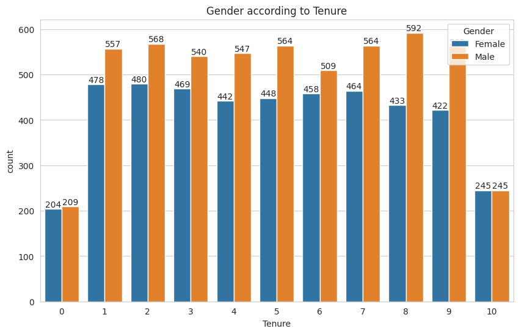
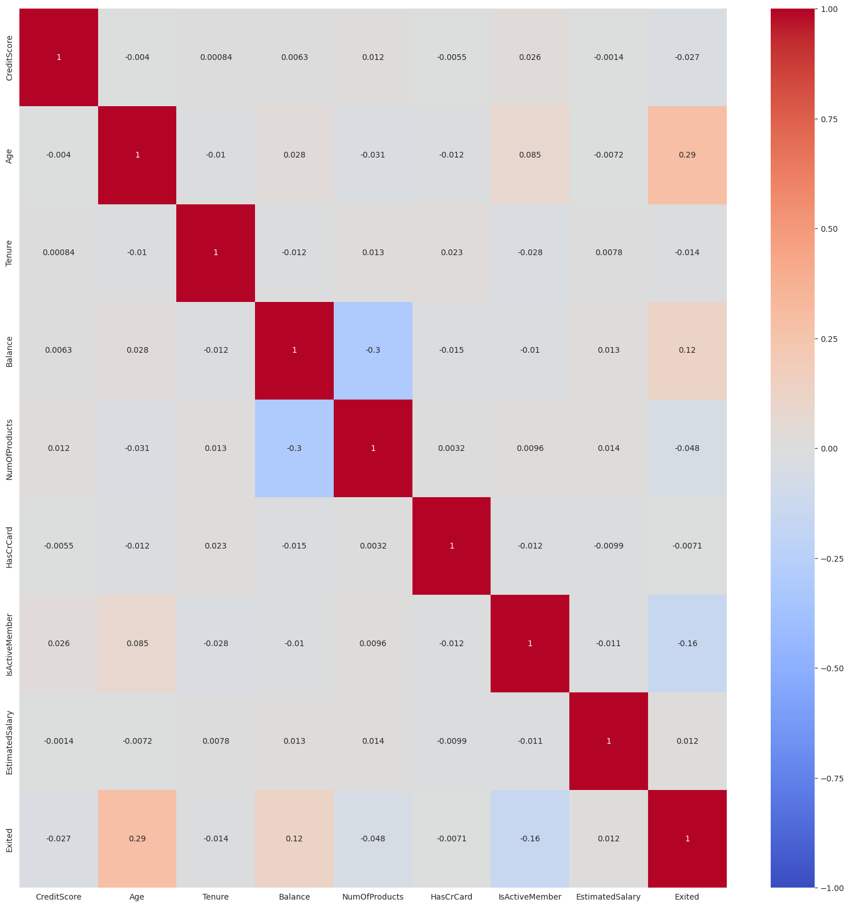
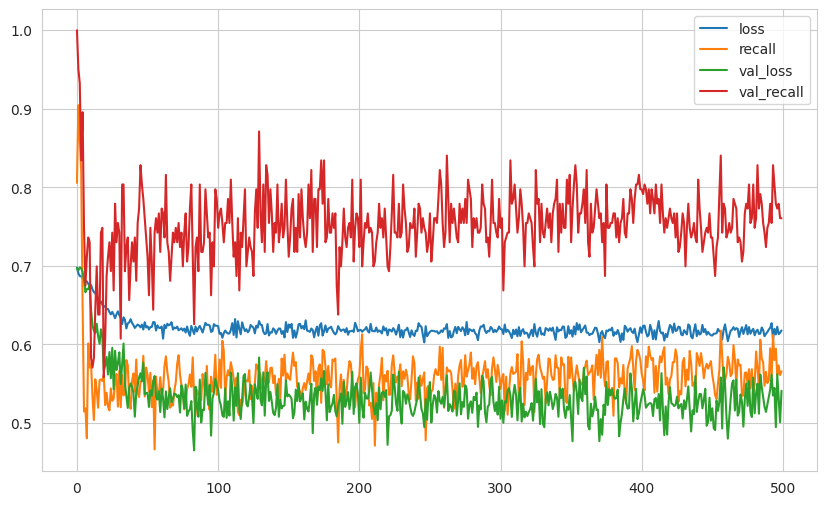
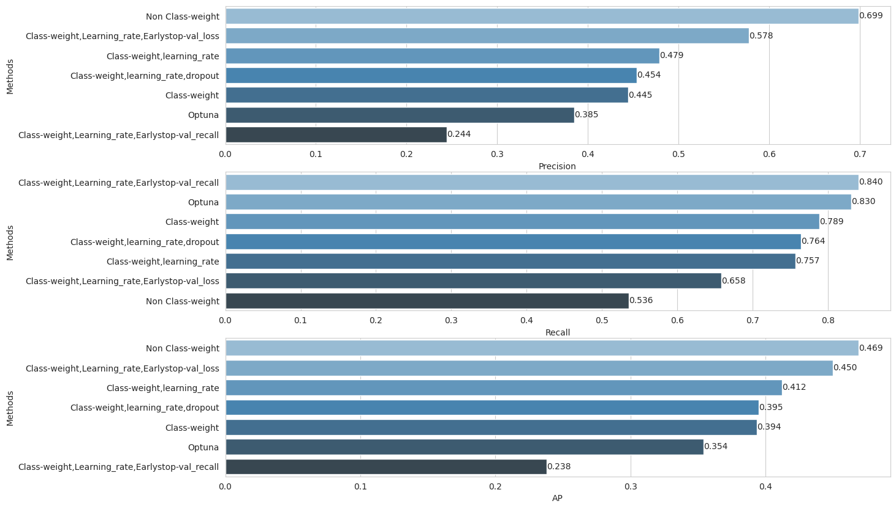

<h1 align="center">
Deep Learning Predictive Modeling of Banking Customer Churn
</h1>

Artificial Neural Network (ANN) based customer churn prediction system for banking retention analytics.

---

<h2> Project Overview</h2>

This project develops a deep learning classification pipeline using Artificial Neural Networks (ANN) 
to predict customers who are likely to leave a bank.

<h3>Objectives</h3>

<ul>
<li>Build an ANN-based churn prediction model</li>
<li>Identify high-risk customers before they leave</li>
<li>Analyze customer behavior patterns</li>
<li>Provide actionable retention strategies</li>
</ul>

---

<h2> Dataset Description</h2>

The dataset contains <b>10,000 banking customers</b> with demographic, financial, and account information.
The target variable is:

<ul>
<li><b>Exited = 1:</b> Customer churned</li>
<li><b>Exited = 0:</b> Customer retained</li>
</ul>

<h3>Features</h3>

<table>
<tr>
<th>Feature</th>
<th>Description</th>
</tr>

<tr>
<td>CreditScore</td>
<td>Customer credit rating</td>
</tr>

<tr>
<td>Geography</td>
<td>Customer country (France, Germany, Spain)</td>
</tr>

<tr>
<td>Gender</td>
<td>Customer gender</td>
</tr>

<tr>
<td>Age</td>
<td>Customer age</td>
</tr>

<tr>
<td>Tenure</td>
<td>Years with bank</td>
</tr>

<tr>
<td>Balance</td>
<td>Account balance</td>
</tr>

<tr>
<td>NumOfProducts</td>
<td>Number of banking products</td>
</tr>

<tr>
<td>IsActiveMember</td>
<td>Customer activity status</td>
</tr>

<tr>
<td>Exited</td>
<td>Churn target variable</td>
</tr>

</table>

---

<h2> Data Analysis</h2>

<h3>Dataset Quality Check</h3>

<ul>
<li>Rows: 10,000</li>
<li>Features: 13</li>
<li>Missing Values: 0</li>
<li>Duplicate Records: 0</li>
</ul>

<h3>Target Distribution</h3>

The dataset is imbalanced:

<ul>
<li>Retained Customers: 79.63%</li>
<li>Churn Customers: 20.37%</li>
</ul>

---

<h2> Exploratory Data Analysis</h2>

<h3>Important Findings</h3>

<table>

<tr>
<th>Feature</th>
<th>Insight</th>
</tr>

<tr>
<td>Age</td>
<td>Older customers show higher churn probability</td>
</tr>

<tr>
<td>IsActiveMember</td>
<td>Inactive customers have higher churn risk</td>
</tr>

<tr>
<td>NumOfProducts</td>
<td>More products improve customer retention</td>
</tr>

<tr>
<td>Balance</td>
<td>Higher balance slightly increases churn risk</td>
</tr>

</table>

---

<h2> Data Preprocessing</h2>

<ul>
<li>One-hot encoding for categorical variables</li>
<li>Feature-target separation</li>
<li>Train/Validation/Test split</li>
<li>Feature scaling using MinMaxScaler</li>
<li>Class imbalance handling using class weights</li>
</ul>

Dataset Split:

<table>

<tr>
<th>Dataset</th>
<th>Samples</th>
</tr>

<tr>
<td>Training</td>
<td>7200</td>
</tr>

<tr>
<td>Validation</td>
<td>800</td>
</tr>

<tr>
<td>Testing</td>
<td>2000</td>
</tr>

</table>

---

<h2> Deep Learning Models</h2>

Seven ANN architectures were developed and compared:

<table>

<tr>
<th>Model</th>
<th>Optimization Strategy</th>
</tr>

<tr>
<td>Model 1</td>
<td>Baseline ANN</td>
</tr>

<tr>
<td>Model 2</td>
<td>Class Weighting</td>
</tr>

<tr>
<td>Model 3</td>
<td>Class Weight + Learning Rate Optimization</td>
</tr>

<tr>
<td>Model 4</td>
<td>Dropout Regularization</td>
</tr>

<tr>
<td>Model 5</td>
<td>Early Stopping (Validation Loss)</td>
</tr>

<tr>
<td>Model 6</td>
<td>Early Stopping (Validation Recall)</td>
</tr>

<tr>
<td>Model 7</td>
<td>Optuna Hyperparameter Optimization</td>
</tr>

</table>

---

<h2> Modeling Challenges & Solutions</h2>

<table>

<tr>
<th>Challenge</th>
<th>Problem Impact</th>
<th>Solution Implemented</th>
</tr>

<tr>

<td>
<b>Class Imbalance</b>
</td>

<td>
Only 20.37% of customers were churned, causing the model to favor retained customers.
</td>

<td>

<ul>
<li>Applied class weighting during ANN training</li>
<li>Focused on Recall for churn detection</li>
<li>Compared precision-recall trade-offs</li>
</ul>

</td>

</tr>

<tr>

<td>
<b>Overfitting Risk</b>
</td>

<td>
Deep neural networks can memorize training patterns and perform poorly on unseen customers.
</td>

<td>

<ul>
<li>Added Dropout regularization</li>
<li>Used Early Stopping</li>
<li>Monitored validation performance</li>
</ul>

</td>

</tr>

<td>
<b>Feature Scale Differences</b>
</td>

<td>
Features such as Balance, Age, and CreditScore have different numerical ranges.
</td>

<td>

<ul>
<li>Applied MinMaxScaler normalization</li>
<li>Improved ANN convergence speed</li>
</ul>

</td>

</tr>

<tr>

<td>
<b>Categorical Variables</b>
</td>

<td>
Machine learning models cannot directly process text categories.
</td>

<td>

<ul>
<li>Applied One-Hot Encoding</li>
<li>Converted Geography and Gender into numerical features</li>
</ul>

</td>

</tr>

<tr>

<td>
<b>Hyperparameter Selection</b>
</td>

<td>
ANN performance depends strongly on architecture and training parameters.
</td>

<td>

<ul>
<li>Compared 7 ANN architectures</li>
<li>Tuned learning rate</li>
<li>Applied Optuna optimization</li>
</ul>

</td>

</tr>

</table>

---

<h2> Model Development Process</h2>

Seven Artificial Neural Network models were developed progressively:

<ol>

<li>
Baseline ANN model
</li>

<li>
Class-weighted ANN for imbalance handling
</li>

<li>
Learning rate optimization
</li>

<li>
Dropout regularization
</li>

<li>
Early stopping based on validation loss
</li>

<li>
Early stopping based on recall optimization
</li>

<li>
Optuna hyperparameter optimization
</li>

</ol>

<h3>Confusion Matrix</h3>

---

<h2> Business Insights</h2>

<h3>High Risk Customer Groups</h3>

<ul>

<li>
<b>Inactive Members:</b>
Higher probability of leaving the bank.
</li>

<li>
<b>Older Customers:</b>
Require personalized retention strategies.
</li>

<li>
<b>Single Product Customers:</b>
Cross-selling additional products may improve loyalty.
</li>

<li>
<b>High Balance Customers:</b>
Need premium services and relationship management.
</li>

</ul>

---

<h2> Business Recommendations</h2>

<ul>

<li>Create an early-warning churn detection system</li>

<li>Launch targeted retention campaigns</li>

<li>Provide personalized financial services</li>

<li>Monitor customer engagement indicators</li>

<li>Use churn probability for proactive customer outreach</li>

</ul>

---

<h2> Future Improvements</h2>

<ul>

<li>Add transaction history and customer behavior data</li>

<li>Develop customer lifetime value prediction</li>

<li>Deploy real-time churn API</li>

<li>Create Streamlit customer risk dashboard</li>

<li>Apply LSTM models for sequential banking behavior</li>

</ul>

---

<h2> Technical Stack</h2>

<ul>

<li>Python</li>
<li>Pandas / NumPy</li>
<li>Scikit-learn</li>
<li>TensorFlow / Keras</li>
<li>Optuna</li>
<li>Matplotlib / Seaborn</li>

</ul>

---

<h2>📁 Project Structure</h2>

<pre>

Banking-Churn-Prediction/

│
├── data/
│   └── churn_data.csv
│
├── assets/
│   ├── churn_distribution.png
│   ├── correlation_matrix.png
│   ├── model_performance.png
│   └── confusion_matrix.png
│
├── notebooks/
│   ├── 01_EDA.ipynb
│   ├── 02_Preprocessing.ipynb
│   └── 03_Model_Training.ipynb
│
├── models/
│   ├── best_model.h5
│   └── scaler.pkl
│
├── src/
│   ├── preprocessing.py
│   ├── model_training.py
│   └── evaluation.py
│
└── README.md

</pre>

---

<h2> Project Summary</h2>

<ul>

<li>Developed 7 ANN churn prediction models</li>

<li>Handled class imbalance using class weighting</li>

<li>Achieved 86% accuracy and 0.861 AUC</li>

<li>Identified key churn drivers</li>

<li>Generated actionable customer retention strategies</li>

</ul>

---

<h2> Results Visualization</h2>

<h3>1. Target Variable Distribution</h3>

Customer churn imbalance analysis.

 

<h3>2. Feature Correlation Analysis</h3>

Relationship between customer attributes and churn behavior.

 

<h3>3. ANN Training Performance</h3>

Training and validation loss/recall curves showing model learning behavior.

 

<h3>4. Model Performance Comparison</h3>

Comparison of precision, recall, and AUC across seven ANN models.

 

---

<h2> 5. Final Model Confusion Matrix</h2>

<table>

<tr>
<th>Metric</th>
<th>Result</th>
</tr>

<tr>
<td>Accuracy</td>
<td>86%</td>
</tr>

<tr>
<td>AUC Score</td>
<td>0.861</td>
</tr>

<tr>
<td>Churn Precision</td>
<td>70%</td>
</tr>

<tr>
<td>Churn Recall</td>
<td>54%</td>
</tr>

<tr>
<td>F1 Score</td>
<td>0.61</td>
</tr>

</table>

The final ANN model successfully identifies high-risk customers while maintaining a balance between detecting churners and reducing false alarms.

<b>Deep Learning + Customer Analytics = Data-Driven Retention Strategy</b>

